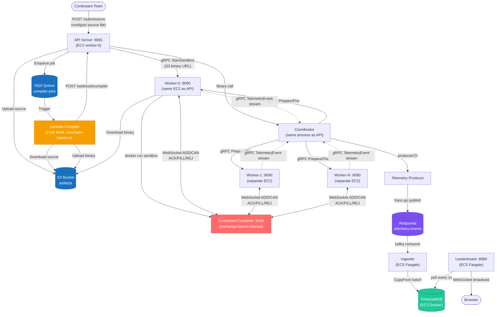
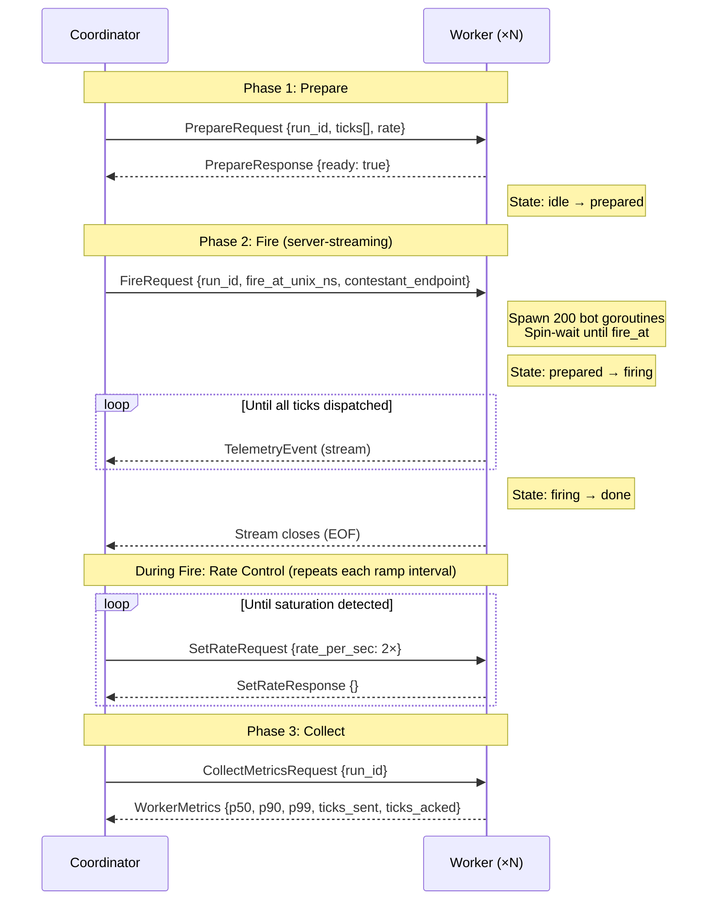
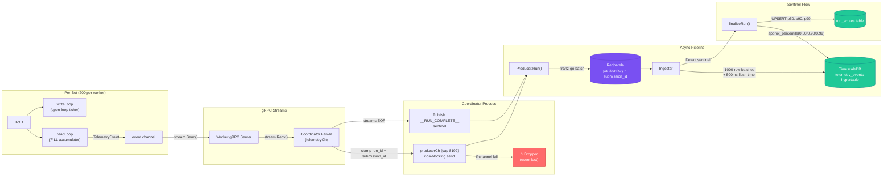

# ExchangeBench Design Document

**Submitted By:** Siddhesh Badnapurkar  
**GitHub:** [github.com/51ddhesh](https://github.com/51ddhesh)  
**Project Repo:** [github.com/51ddhesh/exchange-bench](https://github.com/51ddhesh/exchange-bench)  
**Contact:** siddheshbadnapurkar@gmail.com

## Table of Contents
1. [Overview](#1-overview)
2. [High Level Architecture](#2-high-level-architecture)
3. [Modules](#3-modules)
4. [End-to-End Flow](#4-end-to-end-flow)
5. [Bot Fleet](#5-bot-fleet)
6. [Inter-service Comms with gRPC](#6-inter-service-comms-with-grpc)
7. [Telemetry and Validation](#7-telemetry-and-validation)
8. [Stores](#8-stores)
9. [Real-Time Leaderboard](#9-real-time-leaderboard)
10. [Design Decisions](#10-design-decisions)
11. [Scoring Algorithm](#11-scoring-algorithm)
12. [Sandboxed Execution](#12-sandboxed-execution)
13. [Error Handling and Failure Modes](#13-error-handling-and-failure-modes)
14. [Future Scope](#14-future-scope)

---

## 1. Overview

ExchangeBench evaluates the performance and correctness of high-frequency trading matching engines written by contestants. Instead of running unit tests, it simulates a realistic distributed trading environment: it feeds deterministic limit order book workloads into contestant binaries over WebSocket connections and scores them on correctness, throughput (Peak TPS and Capacity TPS), and latency (P50, P90, P99) under load.

The load generation, telemetry collection, and benchmarking logic live entirely outside contestant code. The open-loop dispatch design means latency measurements capture queueing delays, giving more honest results than traditional closed-loop benchmarks.

---

## 2. High Level Architecture

The platform runs as a set of microservices on AWS. Contestant code is isolated in Docker sandboxes, compilation is offloaded to Lambda, and telemetry flows through Redpanda into TimescaleDB.



### Deployment

Everything runs on AWS in `ap-south-1`. The rough breakdown:

| Component | Where it runs |
|---|---|
| API Server + Worker-0 | EC2 `t3.micro` (`worker-0`), behind an ALB |
| Bot Fleet Workers (1-N) | Additional EC2 `t3.micro` instances |
| Lambda Compiler | AWS Lambda (3 GB RAM, custom Docker image with Go/C++/Rust/Python toolchains) |
| Redpanda | EC2 `t3.micro` |
| TimescaleDB | EC2 `t3.micro` (Docker container) |
| Leaderboard + Ingester | AWS ECS Fargate (512 CPU / 1024 MB) |
| Source & Binary Artifacts | S3 (`exchange-bench-artifacts-*`) |
| Compilation Jobs | SQS (`exchange-bench-compiler-jobs`) |

> **Note on instance sizes:** The current deployment uses `t3.micro` instances to stay within AWS Free Tier limits. For any serious load testing you'll want at least `t3.medium` for the worker nodes — `t3.micro` will OOM under concurrent Rust/C++ Docker workloads.

### Key Components

- **API Server**: Entry point for submissions. Uploads source to S3, enqueues to SQS, receives the Lambda webhook callback, then triggers sandbox provisioning on a worker node and manages score persistence.
- **Lambda Compiler**: Stateless function triggered by SQS. Downloads the source from S3, compiles it (Go/C++/Rust/Python toolchains are baked into the Lambda image), uploads the binary back to S3, and POSTs to the API webhook. Gets 3 GB of RAM — plenty for even the heaviest Rust compilations.
- **Coordinator**: Manages a single benchmark run. Handles workload generation, coordinates the bot fleet, fans in telemetry from all workers, and publishes it to Redpanda.
- **Bot Fleet (Workers)**: gRPC worker nodes that download compiled binaries from S3, launch isolated sandbox containers, and drive hundreds of concurrent WebSocket connections to the contestant. Each worker runs as a Docker container on its EC2 instance with access to the host Docker socket.
- **Telemetry Producer**: A goroutine inside the Coordinator that drains an internal channel (`producerCh`, capacity 8192) and publishes to Redpanda via franz-go. Non-blocking sends — events are dropped rather than backed up if the channel is full.
- **Redpanda**: Kafka-compatible broker (no JVM) that buffers telemetry events. Events are partitioned by `submission_id`.
- **Ingester**: Consumes from Redpanda, batch-inserts into TimescaleDB using `pgx.CopyFrom` (1000-row batches, 500ms flush timer). On seeing the `__RUN_COMPLETE__` sentinel, runs `approx_percentile` queries to compute P50/P90/P99 and upserts the `run_scores` row.
- **Leaderboard Server**: Polls `run_scores` every second and broadcasts updates to connected browsers over WebSockets.

---

## 3. Modules

The codebase is split into discrete packages with clean separation of concerns:

- **Orderbook Engine** (`internal/orderbook`): Core matching engine and reference implementation used for correctness checking. Uses arena allocators for Order structs and node pools for linked-list nodes — zero heap allocations in the hot path.
- **Workload Generator** (`internal/workload`): Generates deterministic, statistically invariant market regimes (Warmup, Normal, MarketMaking, CancelStorm, Spike) using a Box-Muller transform for normally distributed price steps.
- **Protocol** (`internal/protocol`): Serialization/deserialization for order messages over WebSockets. ASCII line format: `ADD o1 B L 100.0000 10\n`.
- **Sandbox** (`internal/runner`): Manages secure, isolated execution of contestant binaries using Docker network namespaces and seccomp profiles.
- **Validator** (`internal/validator`): Replays contestant fills against the reference engine. Detects `OVERFILL`, `UNDERFILL`, `PRICE_TIME_PRIORITY`, `WRONG_EXEC_PRICE`, `ZOMBIE_FILL`, and `CANCEL_MISMATCH`.
- **Botworker** (`internal/botworker`): Open-loop tick dispatchers acting as individual trading clients. Each bot maintains its own WebSocket connection, HDR histogram, and validator correlator.
- **Coordinator** (`internal/coordinator`): Orchestrates distributed evaluation runs. Three-phase model: Prepare → Fire → Collect.
- **Compiler** (`internal/compiler`): Compilation pipelines for C++, Rust, Go, and Python. In AWS mode these are handled by Lambda; locally they run in Docker with `--network=none` and a 50MB binary size cap.
- **Telemetry & Ingester** (`internal/telemetry`): Redpanda producer and TimescaleDB ingester for batch event ingestion and percentile computation.
- **Leaderboard** (`cmd/leaderboard`): Real-time ranking with per-language tier normalization and WebSocket broadcast.

---

## 4. End-to-End Flow

```mermaid
sequenceDiagram
    participant User
    participant API as API Server<br/>(EC2 worker-0)
    participant S3 as S3 Bucket
    participant SQS as SQS Queue
    participant Lambda as Lambda Compiler<br/>(3 GB RAM)
    participant Worker as Worker Node<br/>(EC2)
    participant Sandbox as Contestant Container
    participant Coord as Coordinator<br/>(in-process with API)
    participant Fleet as Bot Fleet (N Workers)
    participant RP as Redpanda
    participant Ingester
    participant TSDB as TimescaleDB
    participant LB as Leaderboard

    User->>API: POST /submissions (source + lang + team_id)
    API->>API: Validate extension, 1MB limit
    API->>API: Assign submission_id (team_1)
    API->>S3: Upload source file
    API->>SQS: Enqueue job {submission_id, s3_key, language}
    API-->>User: HTTP 202 Accepted {submission_id, status: queued}

    SQS->>Lambda: Trigger (event with job metadata)
    Lambda->>S3: Download source
    Lambda->>Lambda: Compile (go/rustc/g++/python)<br/>50MB binary cap
    Lambda->>S3: Upload compiled binary
    Lambda->>API: POST /webhook/compiler {submission_id, artifact_s3_key}

    API->>Worker: gRPC StartSandbox (s3_binary_url)
    Worker->>S3: Download binary
    Worker->>Sandbox: docker run --network=exchange-bench-internal<br/>--read-only --cap-drop=ALL --memory=512m
    Sandbox-->>Worker: Readiness probe OK (WebSocket :8080)
    Worker-->>API: Sandbox endpoint

    API->>Coord: Run(ticks, endpoint)

    Note over Coord,Fleet: Phase 1 — Smoke Test (10K ticks, closed-loop)
    Coord->>Sandbox: Single-bot WebSocket
    Sandbox-->>Coord: ACK/FILL/REJ
    Coord->>Coord: Validate against reference engine
    Coord->>Coord: Enforce 80% correctness gate

    Note over Coord,Fleet: Phase 2 — Distributed Load Test
    Coord->>Fleet: gRPC Prepare (shard ticks + rate)
    Coord->>Fleet: gRPC Fire (fire_at_unix_ns + endpoint)

    loop Rate Ramp-Up (double every interval until saturation)
        Fleet->>Sandbox: Open-loop WebSocket ticks (200 bots/worker)
        Sandbox-->>Fleet: ACK/FILL/REJ responses
        Fleet-.>>Coord: gRPC TelemetryEvent stream
        Coord->>Fleet: gRPC SetRate (2× rate)
        Coord->>Coord: Detect saturation (2 windows ackRate < 95% sendRate)
    end

    Coord->>Fleet: gRPC CollectMetrics
    Fleet-->>Coord: HDR histograms + counts
    Coord->>Coord: Merge metrics, compute PeakTPS + CapacityTPS
    Coord->>RP: Publish sentinel (__RUN_COMPLETE__) via producerCh

    RP->>Ingester: Consume batch
    Ingester->>TSDB: CopyFrom telemetry_events
    Ingester->>TSDB: approx_percentile → upsert run_scores (p50/p90/p99)

    API->>TSDB: Upsert run_scores (PeakTPS, CapacityTPS, correctness, composite_score)
    API->>Sandbox: Kill container

    LB->>TSDB: Poll run_scores every 1s
    LB->>LB: buildTiers → intra-tier normalization
    LB-->>User: WebSocket broadcast (ranked leaderboard)
```

1. **Submission**: Contestant submits source code (`.cpp`, `.rs`, `.go`, or `.py`) plus their team ID via HTTP multipart upload (1MB limit).
2. **Async Compilation**: The API uploads the source to S3 and drops a job message onto SQS. Lambda picks it up, compiles the code using its bundled toolchains, pushes the binary back to S3, and calls `POST /webhook/compiler` to wake up the API. The contestant gets a 202 immediately — no blocking on compilation.
3. **Sandboxing**: On receiving the webhook, the API tells a worker node to download the compiled binary from S3 and launch it in an isolated Docker container on a private bridge network.
4. **Smoke Test**: The Coordinator runs a closed-loop test on the first 10,000 ticks. Submissions that score below 80% correctness are rejected here and never reach the full benchmark.
5. **Preparation**: The full workload is generated and sharded across the Bot Fleet workers via gRPC `Prepare` RPCs.
6. **Fire**: At a synchronized UTC timestamp (`fire_at_unix_ns`), all bots simultaneously start hammering the contestant endpoint over WebSockets. The coordinator ramps the dispatch rate (doubling per interval) until saturation is detected — two consecutive 1-second windows where `ackRate < 95% × sendRate`.
7. **Telemetry**: Workers stream `TelemetryEvent` messages back to the coordinator via gRPC server-streaming. The coordinator stamps `run_id` and `submission_id` on each event and publishes to Redpanda.
8. **Scoring**: The API computes a composite score and upserts into `run_scores`. The ingester independently computes percentile latencies from the raw telemetry.

### Contestant Implementation Protocol

Contestants must implement a WebSocket server listening on `0.0.0.0:8080` with a single route: `/orders`. The platform opens multiple concurrent WebSocket connections to this endpoint. Each connection must have its own isolated matching engine instance — shared state across connections will cause incorrect fills.

Recommended WebSocket libraries by language:
- **C++**: `uWebSockets` (event-driven, C++17)
- **Rust**: `tungstenite` or `tokio-tungstenite`
- **Go**: `coder/websocket` (used by the reference bot)
- **Python**: `websockets` (asyncio-based)

#### Interaction Protocol

**Input (Platform → Contestant)**

Each WebSocket frame contains exactly one ASCII command:
- `ADD <order_id> <side> <type> <price> <qty>`  
  Example: `ADD o1 B L 100.00 10` (Buy, Limit, Price 100, Qty 10)
- `CAN <order_id>`  
  Example: `CAN o1`

**Output (Contestant → Platform)**

The contestant must respond to every command. A single `ADD` may generate multiple `FILL` frames before the final `ACK`. Each must be a separate WebSocket text frame:
- `FILL <taker_order_id> <maker_order_id> <exec_price> <exec_qty>`
- `ACK <order_id>`
- `REJ <order_id> <reason>`

#### Example Execution Flow
```text
Platform:   ADD m1 S L 100.50 5
Contestant: ACK m1

Platform:   ADD t1 B L 100.50 2
Contestant: FILL t1 m1 100.50 2
Contestant: ACK t1

Platform:   CAN m1
Contestant: ACK m1
```

#### Skeleton Reference Code (Go)
```go
func handleOrders(w http.ResponseWriter, r *http.Request) {
    conn, _ := websocket.Accept(w, r, &websocket.AcceptOptions{InsecureSkipVerify: true})
    defer conn.Close(websocket.StatusNormalClosure, "")

    // CRITICAL: one isolated engine per connection
    engine := orderbook.NewEngine()

    for {
        _, msg, err := conn.Read(r.Context())
        if err != nil { break }

        cmd := string(msg)
        if strings.HasPrefix(cmd, "ADD") {
            // 1. Process ADD in your engine
            // 2. Write 0 or more FILL frames: conn.Write(..., []byte("FILL ..."))
            // 3. Write exactly 1 ACK frame: conn.Write(..., []byte("ACK ..."))
        } else if strings.HasPrefix(cmd, "CAN") {
            // 1. Process CAN in your engine
            // 2. Write exactly 1 ACK or REJ frame
        }
    }
}
```

---

## 5. Bot Fleet

Load generation cannot be bottlenecked by a single thread if you want to realistically stress a server.

- **Architecture**: A fleet of `botworker` gRPC nodes (default 5 workers), each running 200 lightweight bot goroutines, for 1,000 total concurrent WebSocket connections.
- **Open-Loop Design**: Bots dispatch ticks based on a deterministic ticker regardless of whether the contestant has responded to the previous tick. The `writeLoop` and `readLoop` run in separate goroutines — they don't block each other.
- **Latency Measurement**: Each order's send timestamp is recorded at dispatch time. When the terminal ACK/REJ arrives, round-trip latency is `(receivedAt - sendTimestamp) / 1000` microseconds, stored in a per-bot HDR histogram.
- **Validation Correlator**: Each bot runs an isolated correlator and reference validator, detecting overfills, underfills, zombie orders, and price-time priority violations locally. One `TelemetryEvent` is emitted per terminal response.

---

## 6. Inter-service Comms with gRPC

The Coordinator controls the worker fleet over a gRPC control plane.



- **`Prepare`** (Unary): Distributes serialized workload shards to workers. Uses 64MB max frame sizes to handle megabytes of tick data.
- **`Fire`** (Server-streaming): Triggers a synchronized start using a future Unix timestamp so all nodes begin firing simultaneously. Returns a server-streaming response of `TelemetryEvent` messages.
- **`SetRate`** (Unary): Lets the coordinator dynamically adjust the per-worker firing rate during the saturation ramp-up. Rate doubles per interval until `MaxRate`.
- **`CollectMetrics`** (Unary): Gathers aggregated HDR latency histograms and tick counts from all nodes after the run.

Worker state machine: `idle → prepared → firing → done`.

---

## 7. Telemetry and Validation

### Telemetry Pipeline

Each order's lifecycle produces a `TelemetryEvent` with:
- `IntendedAtNs`: Nanosecond timestamp when the tick was dispatched.
- `ReceivedAtNs`: Nanosecond timestamp when the ACK/REJ came back.
- **Latency = `ReceivedAtNs - IntendedAtNs`**. Because bots use open-loop dispatch (they don't wait for responses), this captures the full round-trip including any queueing delay at the contestant's server.

Flow:
1. **Bot** records the event → pushes to the worker's internal channel
2. **Worker** sends via gRPC `Fire` stream → **Coordinator** receives
3. **Coordinator** stamps `run_id` + `submission_id`, pushes to `producerCh` (non-blocking, drops on full)
4. **Producer** goroutine publishes to Redpanda (partition key = `submission_id`)
5. **Ingester** consumes from Redpanda, batch-inserts to TimescaleDB

### Validation

Responses (FILLs, ACKs, REJs) are replayed against a perfect reference engine. Checks include:
- **Price-Time Priority**: Fills must execute in strict FIFO order at each price level.
- **No Zombie Fills**: Cancelled orders must never generate a fill.
- **Quantity Matching**: No overfills or underfills.
- **Execution Price**: Fills must occur at the maker's limit price.

Any critical violation (overfill, zombie fill) immediately zeroes the composite score.

---

## 8. Stores



- **Redpanda**: Buffers the massive influx of telemetry events. A million ticks can generate millions of events within seconds — Redpanda keeps the database from bucketing under direct write pressure. Events are partitioned by `submission_id`. Redpanda is optional — omitting `--redpanda-brokers` disables the producer with no impact on scoring.
- **TimescaleDB**: Uses hypertables for time-series ingestion. The `telemetry_events` table is partitioned by `time`. Supports native `approx_percentile` via `percentile_agg` for fast P50/P90/P99 over millions of rows.
- **`run_scores`**: Relational table keyed by `submission_id`. Stores throughput metrics (from the coordinator) and latency percentiles (from the ingester). Both writers use `ON CONFLICT (submission_id) DO UPDATE` to merge their fields.

---

## 9. Real-Time Leaderboard

- **Polling Engine**: A lightweight Go server polls `run_scores` every second. Broadcasts are suppressed when data hasn't changed (JSON equality check).
- **Tier Grouping**: Teams are split into three language tiers for fair comparison:
  - **Systems** (C++, Rust) — compiled, no GC
  - **GC** (Go) — compiled with garbage collector
  - **Interpreted** (Python) — interpreted runtime
- **Intra-Tier Normalization**: Capacity TPS and P99 latency are normalized relative to the best value in the tier, so a Python submission isn't compared against C++ on raw numbers.
- **WebSocket Hub**: Hub-and-spoke broadcast. The hub holds a `sync.Mutex`-guarded map of connected clients. On data change it serializes the payload once and writes to all clients, dropping any that error.
- **Team History**: `GET /api/teams/{teamID}` returns all submissions for a team ordered by attempt (most recent first).
- **Frontend**: Static files served from `cmd/leaderboard/static/`. Rank-change flash animations and dynamic color themes included.

---

## 10. Design Decisions

A few architectural pivots happened during development that are worth documenting:

1. **WebSocket over Stdio Pipes**: The original design used stdin/stdout pipes. This serialized all I/O and made it impossible to test true concurrency. WebSocket connections allow N simultaneous clients, which actually reflects real-world HFT exchange networking.

2. **Pre-allocation Optimization**: The reference engine uses arena allocators for order structs and node pools for linked lists. This keeps heap allocations off the hot path so the benchmark itself doesn't become the bottleneck.

3. **Open-Loop Measurement**: Closed-loop benchmarks (send → wait → send) hide tail latencies. Open-loop tickers expose the full queueing delay because the next tick fires regardless of whether the previous response arrived.

4. **Distributed Load Generation**: Moving load generation out of a monolithic process and across a fleet of gRPC workers separates the testing infrastructure's limits from the contestant's limits. 5 workers × 200 bots = 1,000 concurrent connections.

5. **Async Compilation via Lambda**: Compilation is expensive — Rust in particular can take 30–60 seconds. Offloading to Lambda means the API returns immediately with a 202, and Lambda's 3 GB RAM means even heavy compilations don't OOM. The webhook callback resumes the pipeline once the binary is ready.

6. **Dual Scoring Formulas**: A multiplicative formula picks each team's best submission (rewards raw throughput), while a normalized additive formula ranks teams within tiers (ensures fairness across different metric scales). See [Section 11](#11-scoring-algorithm).

7. **Coordinator-Mediated Telemetry**: Workers don't publish directly to Redpanda. Instead, telemetry fans in through the coordinator via gRPC streams. This keeps the Kafka client dependency in one place and lets the coordinator stamp `run_id`/`submission_id` metadata before publishing.

---

## 11. Scoring Algorithm

Two complementary formulas are used at different stages of the pipeline.

### Stage 1: Best-Submission Selection (API Server)

The API computes a **multiplicative composite score** to select each team's best submission:

```
avg_latency    = (P50_us + P90_us + P99_us) / 3
latency_factor = 1000.0 / GREATEST(1.0, avg_latency)
composite_score = PeakTPS × correctness × latency_factor
```

- **PeakTPS**: Highest ACK rate observed in any 1-second window during the distributed run.
- **Correctness**: `ticks_correct / ticks_sent`.
- **Latency Factor**: Inverse multiplier based on the average of P50/P90/P99. Lower latency → higher multiplier.
- **Critical Demotions**: Any critical correctness violation (overfill, zombie fill) sets `critical_flag = true`, which the leaderboard uses to push the submission below all non-flagged entries regardless of score.

This score drives the `DISTINCT ON (team_id) ORDER BY composite_score DESC` query that picks each team's best run.

### Stage 2: Leaderboard Ranking (Leaderboard Server)

For the public ranking, the leaderboard computes a **normalized additive score** within each language tier:

```
normCapTPS  = CapacityTPS / max_CapacityTPS_in_tier
normLatency = 1 - (P99_us / max_P99_in_tier)

composite = correctness × 0.4 + normCapTPS × 0.4 + normLatency × 0.2
```

- **CapacityTPS** (distinct from PeakTPS): Highest TPS in a 1-second window where **correctness ≥ 95%**. This prevents gaming the score by being fast-but-wrong.
- **Intra-tier normalization**: Both Capacity TPS and P99 latency are normalized against the best value in the tier.
- **Weight distribution**: Correctness 40% + Throughput 40% + Latency 20%.

### Why Two Formulas?

Earlier versions used a single capped latency penalty. This broke down in cases where tiny TPS gains overshadowed big latency improvements.

**Worked example (Team-Alpha):**
- **Submission 1:** 1446 Peak TPS, 1371µs P99
- **Submission 2:** 1444 Peak TPS, 1096µs P99

Submission 2 had 20% better P99 latency but was ranked lower by the old algorithm because the 2 TPS difference outweighed the latency gain. The current approach separates selection (multiplicative, raw performance) from ranking (additive normalized, architectural quality).

---

## 12. Sandboxed Execution

Contestant code is untrusted. The platform enforces deep isolation using hardened Docker configurations:

- **Network Isolation**: Containers run on a dedicated internal bridge network (`exchange-bench-internal`). No internet access — they can only receive inbound WebSocket connections from workers.
- **Resource Constraints**: CPU capped at 2 cores, 512MB memory hard limit with no swap (`--memory-swap=512m`).
- **Filesystem Hardening**: Root filesystem is mounted read-only. A 64MB `tmpfs` at `/tmp` with `noexec` and `nosuid` is the only writable space.
- **Privilege Reduction**: All Linux capabilities dropped (`--cap-drop=ALL`), `--no-new-privileges` enforced.
- **Seccomp Profile** (`deployments/docker/seccomp/contestant.json`): Allow-by-default with explicit blocks on:
  - `mount`, `umount2`, `pivot_root`, `unshare`, `setns` — prevents namespace escape
  - `ptrace` — prevents reading/tracing other processes
  - `init_module`, `finit_module`, `delete_module` — prevents rootkit installation
  - `kexec_load`, `kexec_file_load` — prevents kernel replacement
- **Compilation Isolation**: Source compilation runs in Lambda, entirely separate from the runtime environment. Toolchains are baked into the Lambda image.

---

## 13. Error Handling and Failure Modes

### Compilation Failure
If Lambda fails to compile the code (syntax error, missing dependency, etc.), the webhook callback receives `status: failed` with the compiler's stderr. The submission is marked `failed` and no sandbox is started.

### Sandbox Crash
If the contestant container dies mid-benchmark (OOM kill, segfault), the runner detects `TicksSent < totalTicks` and returns an error. The submission is marked `failed`.

### Worker Failure During Fire
If a worker's gRPC stream errors out during the `Fire` phase, its goroutine logs the error and returns. Remaining workers continue. Metrics from failed workers are replaced with zero-value `WorkerMetrics` during the merge phase. The run still completes, but with potentially degraded throughput numbers.

### Redpanda Unavailability
Redpanda is optional. If `--redpanda-brokers` is not set, `producerCh` is nil and no telemetry is published. Scoring still works because the API computes `composite_score` from coordinator metrics independently. Percentile latency columns in `run_scores` will stay at zero since the ingester has nothing to consume.

### Telemetry Backpressure
The `producerCh` channel (capacity 8192) uses non-blocking sends. Events that would block are silently dropped under extreme load. The scoring pipeline (peak TPS, capacity TPS, correctness) runs off the coordinator's in-memory counters and is unaffected by drops.

### Attempt Tracking
Attempt counters and submission state live in-memory (`sync.Map` with `atomic.Int64` per team). If the API server restarts, counters reset to zero. Only completed `run_scores` rows survive in the database.

### Infrastructure OOM
The `worker-0` instance runs both the API server and contestant Docker sandboxes. Concurrent Rust or C++ compilations (pre-Lambda) or heavy Docker workloads can exhaust memory on a `t3.micro` (1 GiB RAM). The OOM killer may take out the Docker daemon entirely, causing 502/504 ALB timeouts. Use at least `t3.medium` for `worker-0` in production. Compilation itself is now handled by Lambda, so this mainly affects simultaneous benchmark runs.

---

## 14. Future Scope

### Observability & Monitoring
- **Grafana + Prometheus**: Prometheus scraping all services with dashboards for submission pipeline throughput, bot fleet health, Redpanda partition lag, TimescaleDB ingestion rate, and end-to-end submission latency (compile time, smoke test, distributed fire duration).
- **Distributed Tracing (OpenTelemetry + Jaeger)**: Trace spans across the full submission lifecycle — upload → compile → smoke test → distributed fire → ingestion → leaderboard. Makes it easy to figure out whether a slow run is caused by compilation, the contestant, or ingester lag.
- **Telemetry Drop Rate**: Expose a `telemetry_drops_total` Prometheus counter for the `producerCh` non-blocking drops. Currently these are invisible.
- **Redpanda Consumer Lag**: Wire Redpanda's native consumer group lag metrics into Grafana.
- **Per-Run Flame Graphs**: Integrate `pprof` profiling of the coordinator and botworker processes during a live run. Attach flame graph artifacts to each submission so contestants can understand where their server spends time — particularly useful for debugging GC pressure in Go or lock contention in C++.

### Security Hardening
- **Extended Seccomp Coverage**: The current profile doesn't block `fork`, `execve`, `clone`, or socket-related syscalls. These should be added to prevent contestants from spawning child processes, replacing their binary, or binding additional listeners.
- **API Rate Limiting**: No rate limit on `POST /submissions`. A per-team token bucket (e.g. 1 submission per 60 seconds) would prevent queue flooding.
- **Authentication**: Any HTTP client can submit code. A team-token scheme (`Authorization: Bearer <token>`) would prevent impersonation.
- **Build-Time Source Scanning**: Currently compiled languages get `--network=none` inside Lambda, but the source file itself is trusted as-is. A static analysis pass before compilation — scanning for inline assembly in C++ attempting to read `/proc/self/mem`, or Go's `unsafe.Pointer` misuse — would catch malicious payloads before they reach the sandbox.
- **Binary Hash Verification**: The binary downloaded from S3 before a run could theoretically be tampered with in transit. Storing a SHA256 hash of the artifact in the SQS job message and verifying it on the worker before execution closes this gap.

### Reliability
- **Persistent Job Queue**: The current `chan job` is in-memory. An API crash loses pending submissions. Moving to a Redpanda or PostgreSQL-backed queue with at-least-once delivery would fix this.
- **Persistent Attempt Tracking**: Replace the in-memory attempt counter with database-backed tracking (`SELECT MAX(attempt) FROM run_scores WHERE team_id = $1`) to survive restarts.
- **Graceful Shutdown**: On `SIGTERM`, drain the job queue and finish the in-progress run before exiting. Currently a kill loses the active run's results entirely.
- **Worker Health Probing**: The coordinator assumes all gRPC worker addresses are reachable at `Prepare` time. If a worker dies mid-deployment, the coordinator blocks for the full gRPC dial timeout. A lightweight heartbeat RPC that removes unresponsive workers from the active pool before the run starts would make the fleet self-healing.
- **Idempotent Webhooks**: The Lambda compiler webhook has no idempotency key. If the API restarts between Lambda completing and the webhook delivering, the submission is stuck in `queued` forever. A `submission_id`-keyed deduplication table and replay on startup would fix the stuck-submission class of bugs.

### Contestant Experience
- **Live Run Progress**: Stream phase transitions in real-time via SSE or WebSocket: `compiling → smoke test (72% correctness) → distributed fire (ramp: 400→800→1600 TPS) → scoring → done`. Much better than "submit and wait."
- **Submission CLI**: A thin CLI (`exchange-bench submit --team=alpha --lang=cpp source.cpp`) that wraps the multipart upload, polls status, and displays results. Much better than raw curl.
- **Per-Team Historical Charts**: Sparkline charts in the leaderboard frontend showing TPS/latency/correctness trends across attempts. The data is already in `run_scores`.
- **Compilation Error Viewer**: Surface compiler stderr in the API response in a readable, structured format.
- **Diff Feedback on Violations**: When a validation violation fires (e.g. `PRICE_TIME_PRIORITY`), the platform already knows the contestant's output and the reference engine's expected output for that tick. Surfacing a diff — "you returned FILL o3 o1 at 100.00, expected FILL o3 o2 at 100.00 because o2 arrived earlier" — would cut debugging time dramatically for contestants who can't reproduce the failure locally.
- **Local Replay Binary**: A downloadable single binary that replays the exact platform workload (same seed, same tick sequence, same validator) against a contestant's code locally. Removes the "works on my machine" ambiguity entirely.

### Testing & Correctness
- **Chaos Mode**: Inject network delays or CPU throttling into contestant containers mid-run using `tc netem` or cgroup limits. Rewards implementations that handle real-world instability.
- **Replay Tool**: Given a `submission_id`, replay the exact workload (same seed, same tick sequence) against a local binary for debugging.
- **Golden Reference Regression Tests**: Run the reference contestant (`cmd/contestant`) through the full pipeline on CI and assert 100% correctness. Catches platform regressions early.
- **Adversarial Workload Mode**: Generate workloads specifically designed to trigger edge cases — alternating back-and-forth limit orders at the same price to stress FIFO ordering, rapid cancel-then-resubmit cycles on the same order ID to probe zombie-fill protection, large sweeping market orders followed by immediate cancels to test partial-fill accounting. Run these as a separate "stress tier" alongside the standard benchmark.
- **Multi-Contestant Tournament Mode**: Feed two contestant binaries the same order stream simultaneously and compare their fill sequences in real time. Useful for finding matching engine bugs that only appear relative to a specific adversary's book state.
- **Statistical Significance Gating**: A submission's composite score comes from a single run. A contestant right at the 80% correctness boundary is sensitive to workload noise. Running 3 trials and taking the median would make the gate more robust to transient packet loss or CPU scheduling variance.

### Performance
- **Worker Auto-Scaling**: Scale the EC2 worker fleet based on SQS queue depth. No submissions queued → scale down to save cost. Burst of submissions → scale up.
- **Binary Caching**: If a team resubmits identical source (SHA256 match), skip compilation and reuse the existing artifact. This saves 10-60 seconds per duplicate submission and cuts Lambda invocations.
- **Connection Pool Warming**: Pre-establish WebSocket connections during the gRPC `Prepare` phase instead of during `Fire`, removing connection setup overhead from the measurement window.
- **Tick Compression**: The protobuf `Tick` messages sent in `PrepareRequest` are uncompressed. For 1M ticks that's several MB per worker. zstd compression on the serialized shard before sending would reduce gRPC message sizes significantly and speed up the Prepare phase.
- **NUMA-Aware Worker Pinning**: On multi-socket EC2 instances, cross-NUMA memory access adds noise to the histogram measurements. Pinning the botworker process to a single NUMA node with `numactl --cpunodebind=0 --membind=0` removes this source of measurement variance.

### Infrastructure & Sandboxing
- **KVM + Firecracker**: Migrate from Docker containers to Firecracker microVMs. True hardware-level virtualization with millisecond boot times and a much smaller kernel attack surface.
- **Dynamic Linking**: Establish a shared object pool and use dynamic linking inside Firecracker to reduce build times and memory footprint.
- **Ephemeral Sandboxes per Bot Connection**: Currently all 200 bots on a worker connect to a single contestant container. A future design could give each bot its own Firecracker microVM — complete isolation, no shared kernel namespaces, no possibility of one bot's ordering behavior affecting another's via shared process state.
- **Artifact Lifecycle Management**: S3 artifacts accumulate indefinitely. An S3 lifecycle policy expiring artifacts older than N days, combined with a database flag marking artifacts as expired, keeps storage costs bounded.

### Language Support
- **Zig**: A Zig compilation pipeline exists in commented-out form in `internal/compiler/languages.go`. Enabling it requires uncommenting the language entry and testing the Zig toolchain inside the compiler container.
- **Java / JVM Languages**: JVM startup time is a known disadvantage for WebSocket server workloads. Supporting Java or Kotlin would require a longer sandbox readiness probe and a JVM warm-up phase before the smoke test. GraalVM native images could bring startup times close to Go.
- **WebAssembly**: WASM runtimes like Wasmtime support near-native execution with strong sandboxing at the language level. A contestant writing in C, Rust, or AssemblyScript could compile to WASM and run in a Wasmtime sandbox instead of Docker — eliminating container overhead entirely.

### Measurement Accuracy
- **True Coordinated Omission Correction**: Currently `IntendedAtNs` is set to `time.Now()` at actual send time, not the ticker's pre-calculated schedule time. Under send-side backpressure (TCP buffer full, GC pause), this absorbs part of the delay before measurement begins. The fix: record `intendedAt = fireAt + tickIndex × interval` to capture the full queueing delay from the scheduled fire time.
- **Clock Synchronization Verification**: The synchronized fire timestamp (`fire_at_unix_ns`) assumes all worker clocks agree within a few milliseconds. EC2 uses the Amazon Time Sync Service (Chrony) which typically achieves <1ms accuracy, but this is never verified before a run. A clock skew check at `Prepare` time — rejecting the run if skew exceeds a threshold — would make the measurement contract explicit.
- **Histogram Merging Accuracy**: Per-worker HDR histograms are merged at `CollectMetrics` using `hdrhistogram.Merge()`. This merge is exact for counts but loses precise per-tick timestamp data. Shipping raw histogram buckets to the coordinator and recomputing percentiles on the combined dataset would be more accurate than merging compressed representations.
- **Separate Fill and ACK Latency**: Currently latency is measured from tick dispatch to terminal ACK. For orders that generate FILLs, the fills arrive before the ACK — but their individual latencies aren't recorded separately. Tracking dispatch-to-first-FILL versus dispatch-to-ACK would expose whether contestants are deferring fill reporting (batching all fills and emitting at ACK time vs. streaming them as matches occur). A contestant that holds fills and emits them all at ACK time looks correct but hides internal ordering violations that would matter in production.
- **RDTSC Hardware Timestamps**: Every `time.Now()` call in the botworker hot path goes through the vDSO and costs ~15–50ns. At high tick rates this adds measurable noise to both `IntendedAtNs` and `ReceivedAtNs`. The x86 `RDTSC` instruction reads the CPU hardware cycle counter in ~1–5ns with no kernel involvement. Replacing `time.Now()` in the write and read loops with a CGo shim or a hand-written `.s` assembly file would eliminate this noise floor. Caveats: the TSC must be invariant (checked at startup via `CPUID.80000007H:EDX[8]`); raw cycle counts need calibration against `CLOCK_MONOTONIC` to convert to nanoseconds since TSC frequency varies per instance family; and while modern EC2 HVM instances expose a stable invariant TSC, burstable instance types like `t3.micro` may not guarantee it. For a platform whose entire value proposition is latency measurement accuracy, this is the highest-leverage single change available.
