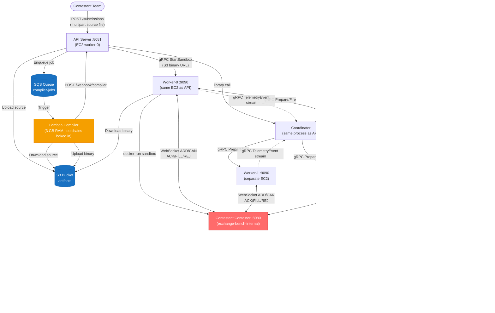
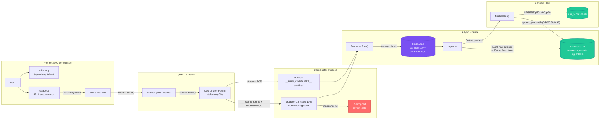
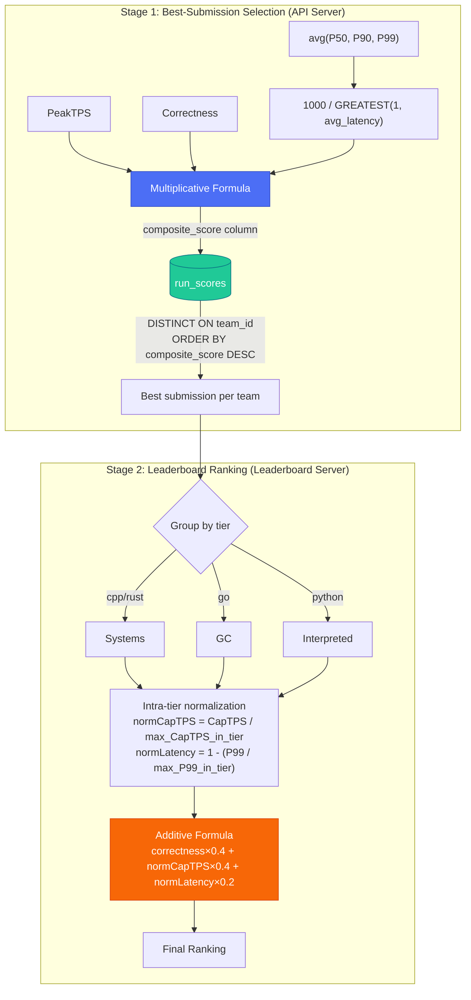
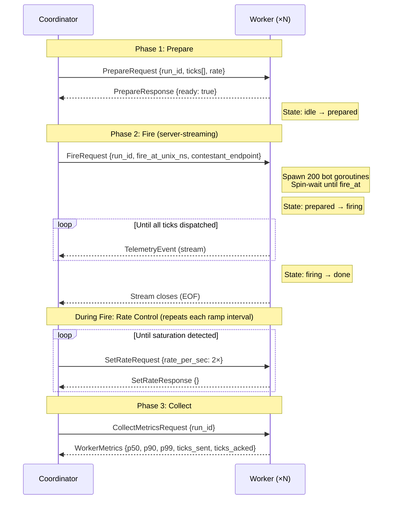
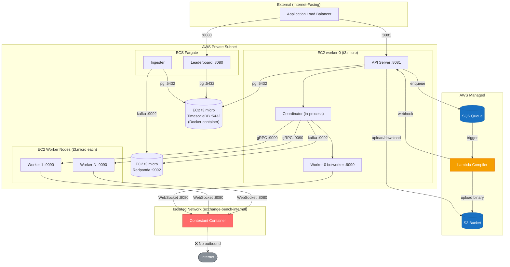
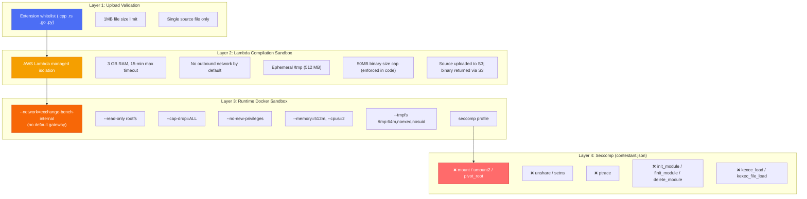
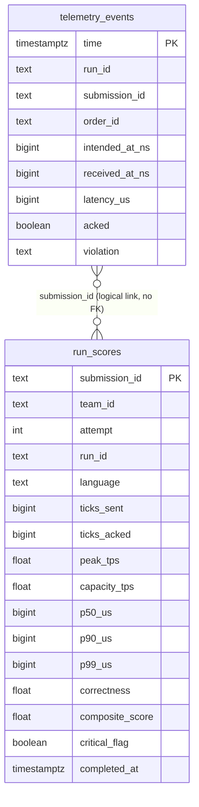
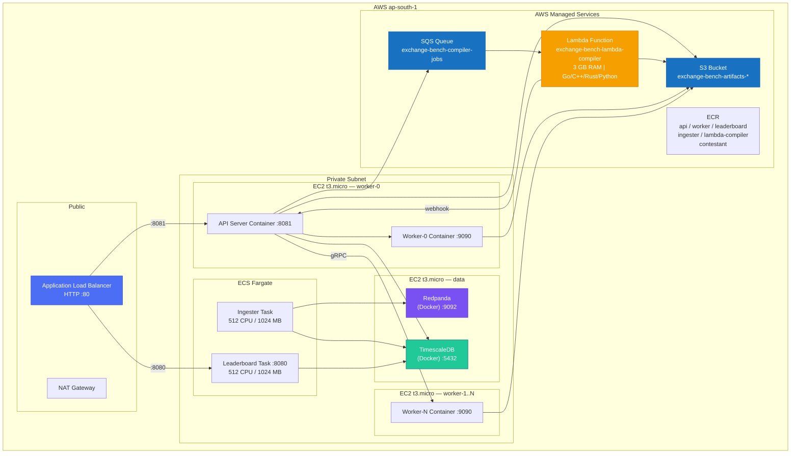

# ExchangeBench — System Architecture & Diagrams

A visual architecture reference for ExchangeBench, the distributed exchange benchmarking platform.

---

## 1. System Overview



---

## 2. Submission Lifecycle

```mermaid
sequenceDiagram
    participant User
    participant API as API Server<br/>(EC2 worker-0)
    participant S3 as S3 Bucket
    participant SQS as SQS Queue
    participant Lambda as Lambda Compiler<br/>(3 GB RAM)
    participant Worker as Worker Node<br/>(EC2)
    participant Sandbox as Contestant Container
    participant Coord as Coordinator<br/>(in-process with API)
    participant Fleet as Bot Fleet (N Workers)
    participant RP as Redpanda
    participant Ingester
    participant TSDB as TimescaleDB
    participant LB as Leaderboard

    User->>API: POST /submissions (source + lang + team_id)
    API->>API: Validate extension, 1MB limit
    API->>API: Assign submission_id (team_1)
    API->>S3: Upload source file
    API->>SQS: Enqueue job {submission_id, s3_key, language}
    API-->>User: HTTP 202 Accepted {submission_id, status: queued}

    SQS->>Lambda: Trigger (event with job metadata)
    Lambda->>S3: Download source
    Lambda->>Lambda: Compile (go/rustc/g++/python)<br/>50MB binary cap
    Lambda->>S3: Upload compiled binary
    Lambda->>API: POST /webhook/compiler {submission_id, artifact_s3_key}

    API->>Worker: gRPC StartSandbox (s3_binary_url)
    Worker->>S3: Download binary
    Worker->>Sandbox: docker run --network=exchange-bench-internal<br/>--read-only --cap-drop=ALL --memory=512m
    Sandbox-->>Worker: Readiness probe OK (WebSocket :8080)
    Worker-->>API: Sandbox endpoint

    API->>Coord: Run(ticks, endpoint)

    Note over Coord,Fleet: Phase 1 — Smoke Test (10K ticks, closed-loop)
    Coord->>Sandbox: Single-bot WebSocket
    Sandbox-->>Coord: ACK/FILL/REJ
    Coord->>Coord: Validate against reference engine
    Coord->>Coord: Enforce 80% correctness gate

    Note over Coord,Fleet: Phase 2 — Distributed Load Test
    Coord->>Fleet: gRPC Prepare (shard ticks + rate)
    Coord->>Fleet: gRPC Fire (fire_at_unix_ns + endpoint)

    loop Rate Ramp-Up (double every interval until saturation)
        Fleet->>Sandbox: Open-loop WebSocket ticks (200 bots/worker)
        Sandbox-->>Fleet: ACK/FILL/REJ responses
        Fleet-.>>Coord: gRPC TelemetryEvent stream
        Coord->>Fleet: gRPC SetRate (2× rate)
        Coord->>Coord: Detect saturation (2 windows ackRate < 95% sendRate)
    end

    Coord->>Fleet: gRPC CollectMetrics
    Fleet-->>Coord: HDR histograms + counts
    Coord->>Coord: Merge metrics, compute PeakTPS + CapacityTPS
    Coord->>RP: Publish sentinel (__RUN_COMPLETE__) via producerCh

    RP->>Ingester: Consume batch
    Ingester->>TSDB: CopyFrom telemetry_events
    Ingester->>TSDB: approx_percentile → upsert run_scores (p50/p90/p99)

    API->>TSDB: Upsert run_scores (PeakTPS, CapacityTPS, correctness, composite_score)
    API->>Sandbox: Kill container

    LB->>TSDB: Poll run_scores every 1s
    LB->>LB: buildTiers → intra-tier normalization
    LB-->>User: WebSocket broadcast (ranked leaderboard)
```

---

## 3. Telemetry Pipeline



---

## 4. Dual Scoring System

ExchangeBench uses **two distinct scoring formulas** at different stages:



| Stage | Formula | Used For |
|---|---|---|
| **Selection** | `PeakTPS × correctness × (1000 / avg(P50,P90,P99))` | Picking each team's best submission |
| **Ranking** | `correctness×0.4 + (capTPS/maxCapTPS)×0.4 + (1-P99/maxP99)×0.2` | Final leaderboard display with per-tier normalization |

**Key distinctions:**
- **PeakTPS** = highest raw ACK rate in any 1-second window
- **CapacityTPS** = highest ACK rate in a window where correctness ≥ 95%
- Selection formula uses PeakTPS; ranking formula uses CapacityTPS
- Critical violations (overfill, zombie fill) zero the composite_score, preventing selection

---

## 5. gRPC Control Plane



All RPCs are defined in `internal/coordinator/proto/coordinator.proto`:
- `Prepare` — Unary RPC
- `Fire` — **Server-streaming** RPC (unary request, streaming response)
- `SetRate` — Unary RPC
- `CollectMetrics` — Unary RPC

---

## 6. Network Boundaries



| Boundary | Components | Protocol |
|---|---|---|
| **External** | ALB → API, ALB → Leaderboard | HTTP |
| **Internal** | Coordinator → Workers | gRPC |
| **Internal** | Coordinator → Redpanda, Ingester → Redpanda | Kafka (:9092) |
| **Internal** | Ingester/Leaderboard/API → TimescaleDB | PostgreSQL |
| **AWS Managed** | API ↔ S3, API → SQS, Lambda → API | HTTPS |
| **Isolated** | Workers → Contestant | WebSocket (no outbound gateway) |

---

## 7. Security Layers



---

## 8. Database Schema



- `telemetry_events` is a **TimescaleDB hypertable** partitioned by `time`
- `run_scores` is a regular PostgreSQL table with `submission_id` as primary key
- `latency_us` is computed as `(received_at_ns - intended_at_ns) / 1000`
- Index: `idx_telemetry_submission ON telemetry_events (submission_id, time DESC)`
- Index: `idx_run_scores_team ON run_scores (team_id, composite_score DESC)`

---

## 9. AWS Production Architecture



| Component | What runs it | Instance/Config |
|---|---|---|
| API Server | EC2 Docker container | `t3.micro` (worker-0) |
| Worker-0 botworker | EC2 Docker container | `t3.micro` (worker-0, same host as API) |
| Worker-1..N | EC2 Docker container | `t3.micro` per worker |
| Leaderboard | ECS Fargate | 512 CPU / 1024 MB |
| Ingester | ECS Fargate | 512 CPU / 1024 MB |
| Lambda Compiler | AWS Lambda | 3 GB RAM, custom image |
| Redpanda | EC2 Docker container | `t3.micro` |
| TimescaleDB | EC2 Docker container | `t3.micro` |
| Artifacts + Binaries | S3 | `exchange-bench-artifacts-*` |
| Compilation Jobs | SQS | `exchange-bench-compiler-jobs` |
| Container Images | ECR | 6 repositories |
